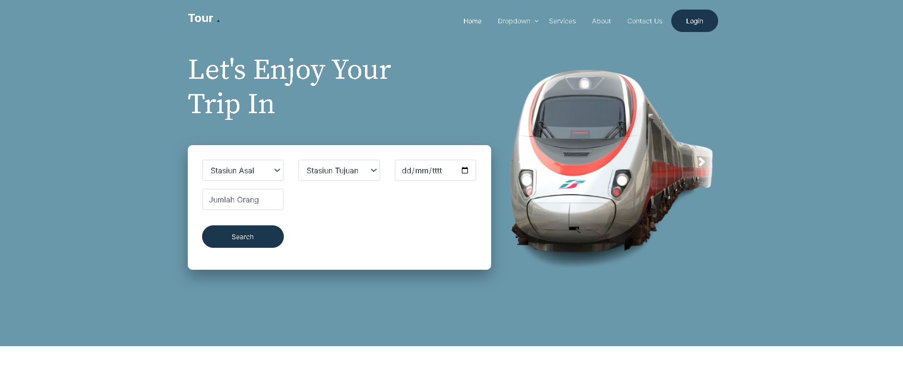
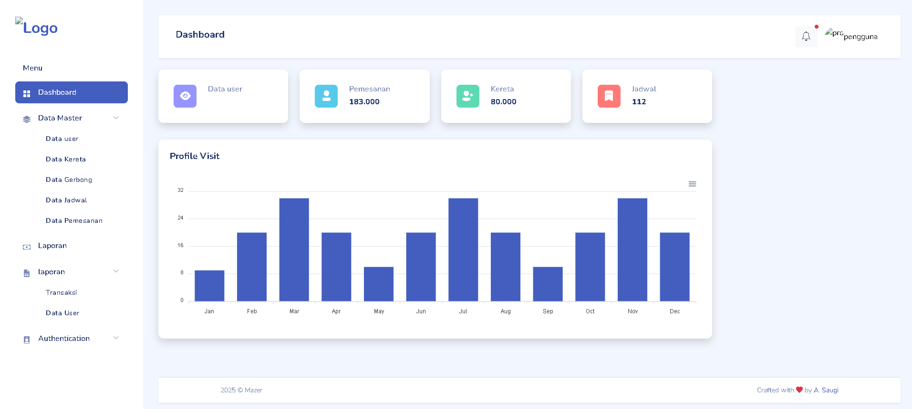
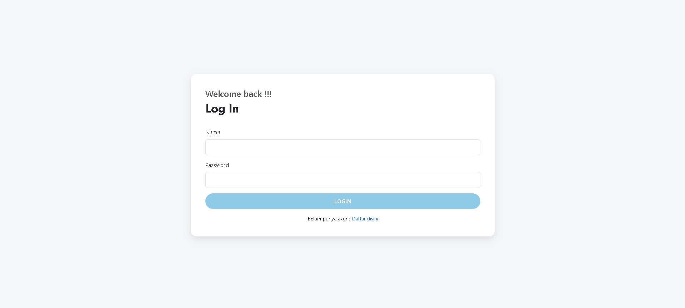
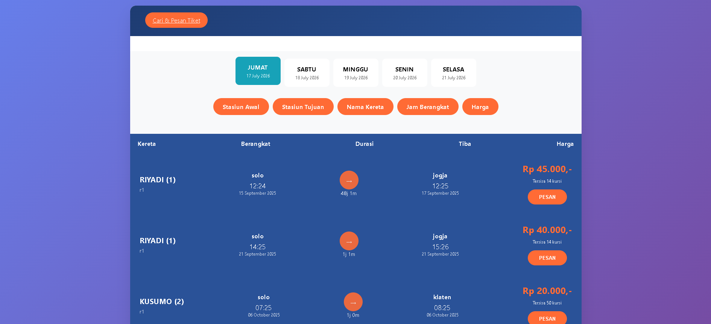
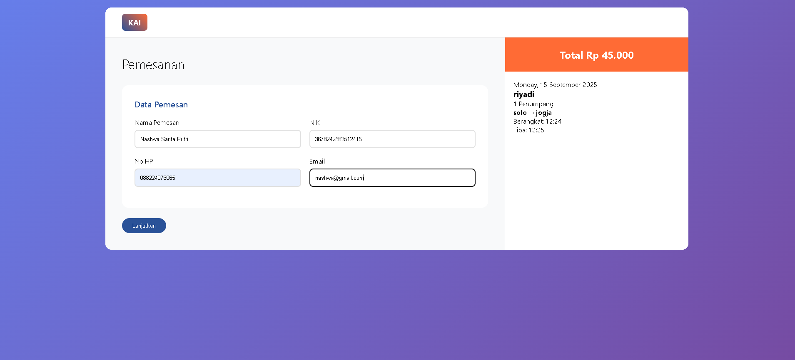
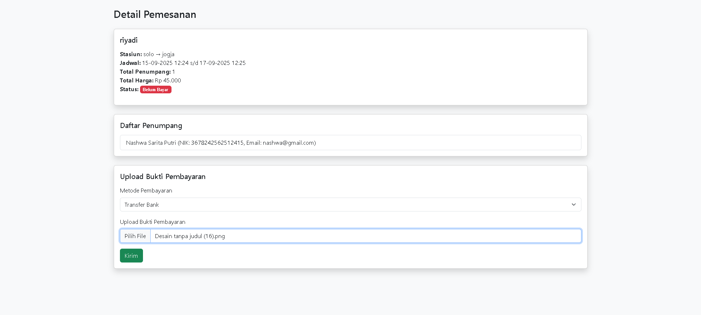
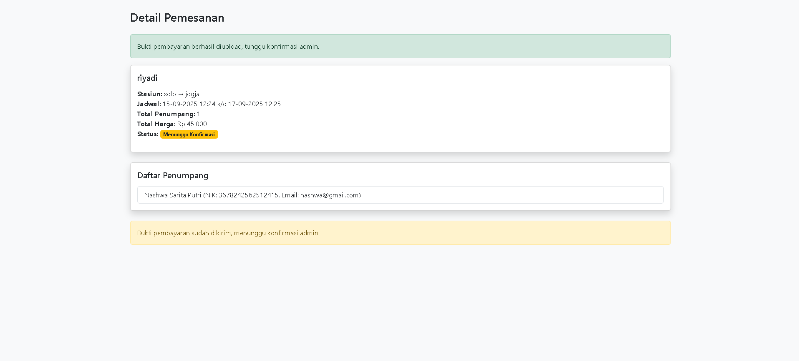
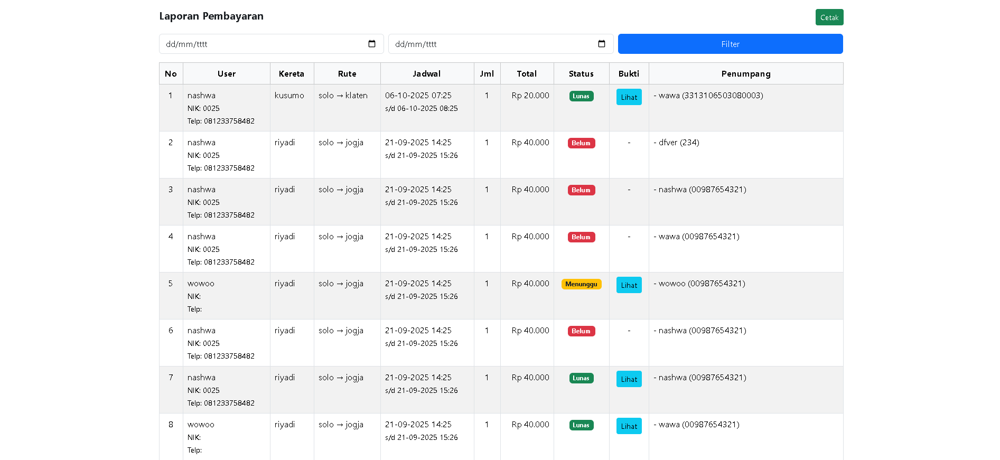

# Website Tiket Kereta

## Deskripsi

Website Tiket Kereta merupakan aplikasi berbasis **CodeIgniter 3** yang dirancang untuk memudahkan pengguna dalam melakukan pemesanan tiket kereta secara online. Aplikasi ini menyediakan fitur pencarian jadwal kereta, pemesanan tiket, pengelolaan data penumpang, hingga riwayat transaksi sehingga proses pembelian tiket menjadi lebih praktis, cepat, dan terorganisir.

---

## Fitur Utama

### Pengunjung
- Registrasi dan Login
- Melihat Jadwal Kereta
- Mencari Kereta Berdasarkan Rute
- Pemesanan Tiket Kereta
- Input Data Penumpang
- Riwayat Pemesanan
- Detail Transaksi
- Logout

### Admin
- Login Admin
- Dashboard
- Manajemen Data Kereta
- Manajemen Jadwal Kereta
- Manajemen Stasiun
- Manajemen Data Penumpang
- Manajemen Data Pemesanan
- Konfirmasi Pembayaran
- Laporan Transaksi
- Logout

---

## Teknologi yang Digunakan

- PHP
- CodeIgniter 3
- MySQL
- Bootstrap
- HTML5
- CSS3
- JavaScript
- jQuery

---

## Struktur Folder

```text
application/
assets/
system/
uploads/
index.php
```

---

## Cara Menjalankan Project

1. Clone repository

```bash
git clone https://github.com/username/website-tiket-kereta.git
```

2. Pindahkan project ke folder:

```text
htdocs/
```

3. Import database ke MySQL melalui phpMyAdmin.

4. Atur konfigurasi database pada file:

```text
application/config/database.php
```

5. Jalankan XAMPP (Apache & MySQL).

6. Buka browser dan akses:

```text
http://localhost/website-tiket-kereta
```

---

## Tampilan Aplikasi

### Halaman Pengunjung


### Halaman Admin


### Login


### Daftar Tiket


### Pemesanan


### Detail Pemesanan


### konfirmasi pemesanan


### Laporan


Website ini memiliki tampilan yang responsif dan mudah digunakan, sehingga memudahkan pengguna dalam melakukan pencarian jadwal serta pemesanan tiket kereta.


---

## Kontributor

**Nashwa Sarita Putri**
